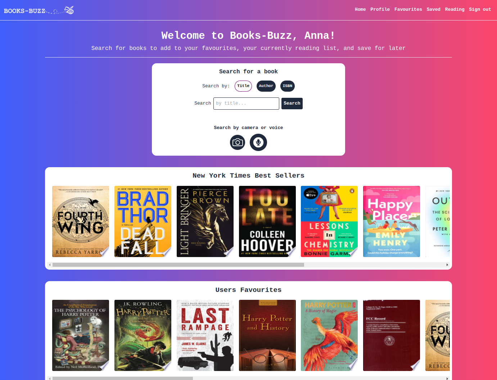

# Books-Buzz Web App

🎬 **Click on the image above to check out the Books-Buzz Presentation Video.** 🎬

## Project Description

Books-Buzz is a responsive web application designed to enhance your reading experience by providing tools to organize your reading preferences, discover new books, and engage with a community of book enthusiasts.

This project was developed as the final group project of the Northcoders Software Development Bootcamp.

### Explore Books-Buzz live at: https://books-buzz-app.netlify.app/

## Features

### 📚 Book Barcode Scanning

Utilize the convenience of your mobile camera to scan book barcodes while on the go. Scanned books are saved to your profile for future reference.

### 📚 Voice-Activated Search

Use your voice to perform searches within Books-Buzz. If your browser supports it, you can enjoy a hands-free search experience. Simply click the microphone icon and speak the title or author of the book you're looking for.

### 📚 Manual Search Functionality

Search for books by manual typing, author, title, or ISBN.

### 📚 Profile Creation and Login

Users can easily create profiles and log in to access their personalized reading experience.

### 📚 Recommendations and Community Engagement

-   **New York Times Bestsellers**: Stay updated with the latest New York Times bestsellers, helping you discover books that are trending.

-   **Users Favourites**: Explore the community's favorites and get recommendations based on popular books among other users.

### 📚 Interactive Map

-   **Local Bookshops and Libraries**: Discover nearby bookshops and libraries through an interactive map. This feature encourages users to explore local literary resources and expand their reading horizons.

### 📚 Detailed Book Pages

-   **Comprehensive Book Details**: Click on book cover thumbnails to access detailed pages for each book, offering information about the book's plot, author, and more.

-   **Book Shelves**: Organize your reading list by categorizing books into different shelves, including:
    -   Favourites
    -   Currently Reading
    -   Save for Later
    -   Marked as Read

## Technologies Used

-   **Frontend Framework**: Next.js
-   **Authentication and Database**: Firebase (Firestore)
-   **API Integration**: Google Books API
-   **UI Framework and Styling**: Tailwind CSS, CSS

#### Experience a new way of engaging with books through the Books-Buzz web app. Happy reading! 📚 ✨
